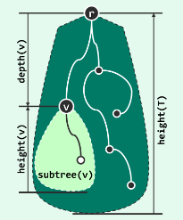

## 树（Tree）

数据结构中，数组或者列表这样的结构，称之为线性结构，元素串联起来，就像一条线一样。除了首尾两个元素对应缺少前驱和后继元素之外，其他元素都有唯一的前驱和后继。如果一个元素只有一个前驱和多个后继。那么这样的结构就是树了，树相对于列表可以称之为半线性结构。

树是一种半线性的数据结构。这种半线性结构如果设计精巧，可在查找，更新，插入删除中达到O(logn)时间的时间复杂度。树是由一组顶点（vertex）以及连接其他若干条边（edge）组成。我们可以指定一个特定的顶点为根节点（root），也称之为节点（node）。

多个节点通过边相连起来组成连通路是为路径（path）。在树中，由根节点r通往每个节点v的路径是唯一的，所经过的边的数目，称之为该节点v的深度depth(v)。

节点孩子的总数称之为度（degree），没有子孩子的节点称为叶子节点（leaf）。树种所有节点最大的深度称之为该树的高度（height）。

> 每个节点都可以以自身为根节点成为一个树，这个树即为原来树的子树。此时该树的高度及以该节点为根节点的最大深度。

从树的顶点r出发一直到v，沿途的所有点相对于v而言，都是v的祖先。 

当然，如果一个树一个节点也没有，可以称之为空树，我们可以定义，空树的高度为-1。如果只有一个节点的数，其高度则是0，毕竟一个节点既是根节点也是叶子节点，而根到叶子的路径为0，或者说深度也为0，因此其高度为0。

